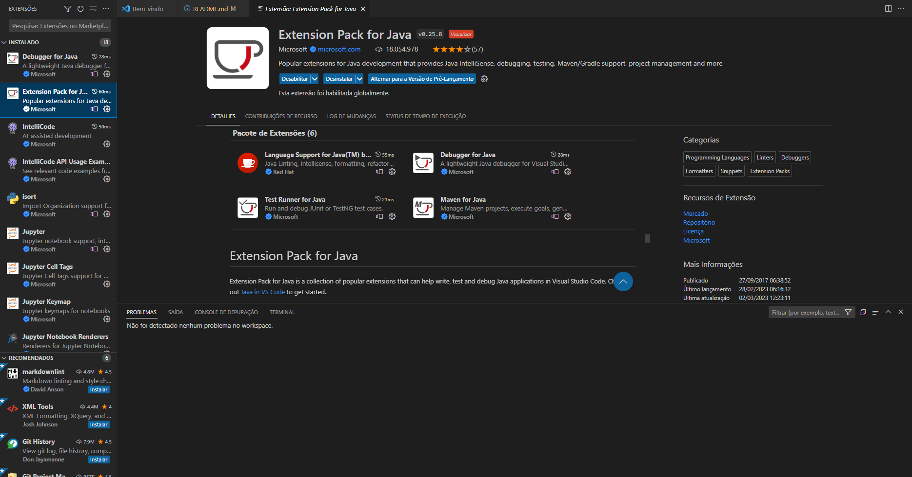
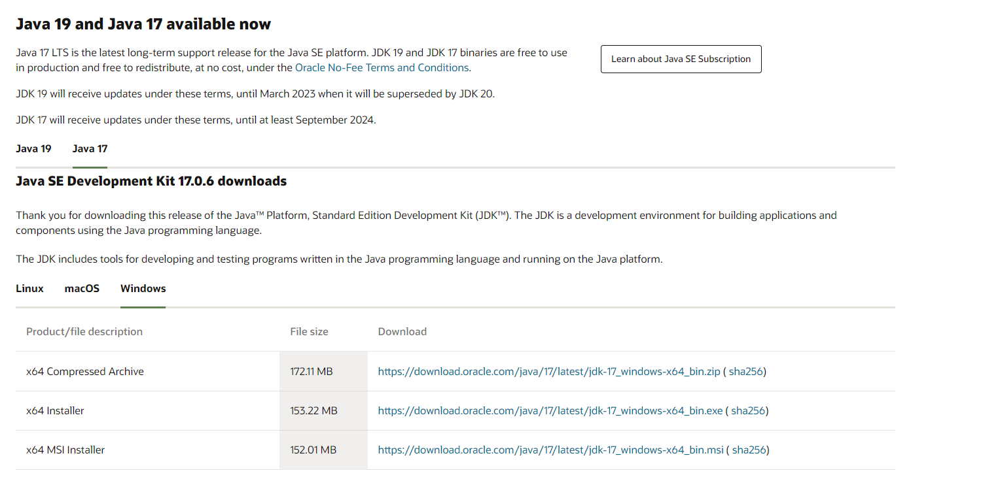

<h1 align="center">Coin Conversor &#x1F4B2;</h1>

# &#x1F587;&#xFE0F; Badges

# &#x270F;&#xFE0F; Descrição-do-Projeto

Conversor de moeda desenvolvido em Java, utilizando a biblioteca Swing como GUI (Graphical User Interface).
Esse conversor realiza a conversão de moeda em real para dollar, libras, euros, peso argentino e peso chileno, e conversão de modo inverso.
Desenvolvemos uma classe para consumir uma API tornando a cotação dinâmica, as cotações são atualizadas a cada 30 segundos, consumindo uma API chamada awesomeapi, documentação disponível em: (https://docs.awesomeapi.com.br/api-de-moedas). 
(<strong>OBS: Foi desenvolvido por mim, juntamente com o meu amigo Cássio Laurentino que se ofereceu a me ajudar a desenvolver pelo fato de eu nunca ter trabalhado com uma API anteriormente. O link do perfil do git dele vai estar disponível no tópico "Pessoas-Desenvolvedoras-do-Projeto").</strong>

# 	&#x1F528; Funcionalidades (em imagens)

<strong>Tela inicial onde escolhemos de qual moeda queremos converter:</strong> 
 

<strong>Tela valor onde dizemos o valor que queremos converter:</strong> 
 

<strong>Tela convertido mostra o resultado da conversão e espera a confirmação do usuário para avançar para a próxima tela:</strong> 
 

<strong>Tela repete pergunta se o usuário quer tentar novamente, se sim, ele retorna para as opções de moedas, se não, ele mostra uma tela de agradecimento:</strong> 
 

<strong>Tela final onde mostra a mensagem citada na funcionalidade anterior:</strong> 

# 📁 Acesso ao projeto

Para acessar o projeto, precisamos ter um editor de código(Recomendo o VSCode + o pack de extensões do java) e o java JDK/JRE para que a janela de interface seja acionada no momento de rodar o programa. Para baixar a JRE é só acessar esse site: https://www.oracle.com/br/java/technologies/downloads/#jdk17-windows

Para baixar o VSCode: https://code.visualstudio.com/download

    

    

# &#x1F468;&#x200D;&#x1F4BB; Pessoas-Desenvolvedoras-do-Projeto

Antonio Carlos

Cassio Laurentino -> https://github.com/CassioLaurentino
